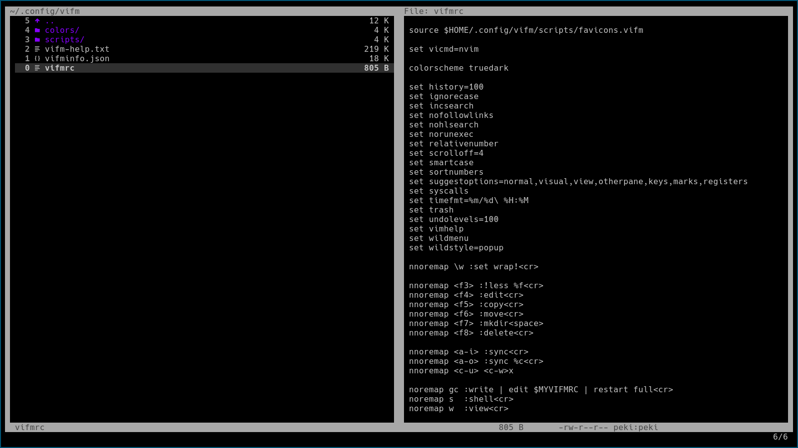

# ⬛ truedark-vifm ⬛
A true dark theme. For Vifm. Duh.

## About truedark-vim
truedark-vifm is a colorscheme for Vifm. It has a pure, #000000, black background. And also a bunch of colors from all around the color spectrum!

## Installation
truedark-vim is installed manually into `$HOME/.config/vifm/colors`.

## Showcase:

