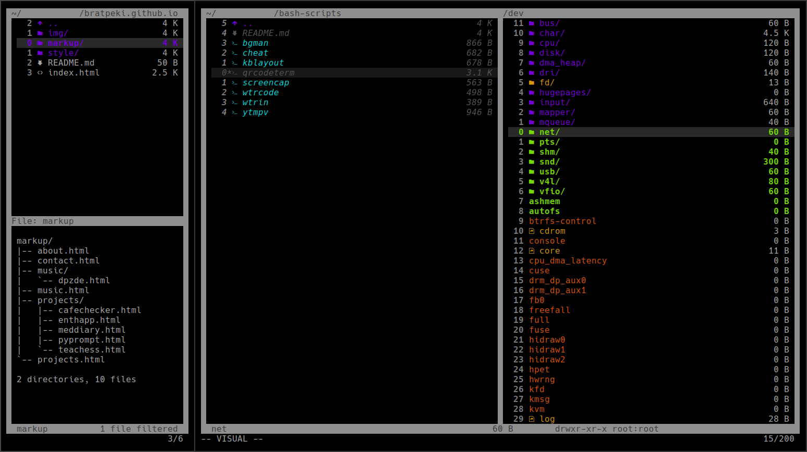

# ⬛ truedark-vifm ⬛
A true dark theme. For Vifm. Duh.

## About truedark-vim
truedark-vifm is a colorscheme for Vifm. It is largely inspired by [truedark-vim](https://github.com/bratpeki/truedark-vim/).

You can now find it on the [official Vifm colorschemes repo](https://github.com/vifm/vifm-colors) :)

## Installation
truedark-vifm is installed manually into `$HOME/.config/vifm/colors`.

## Showcase:

